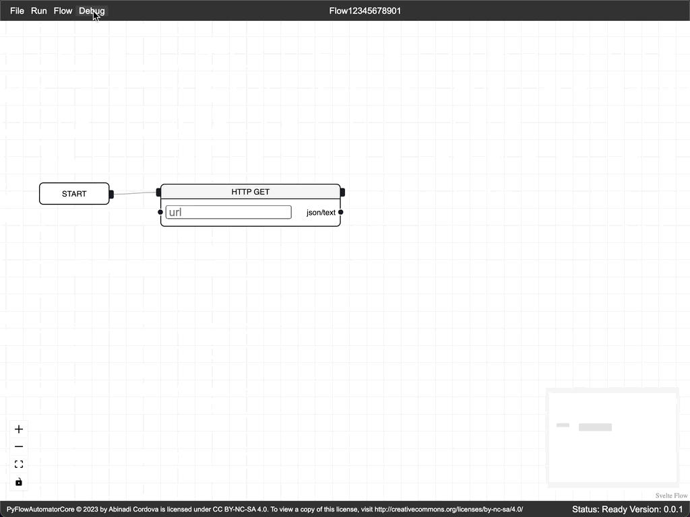
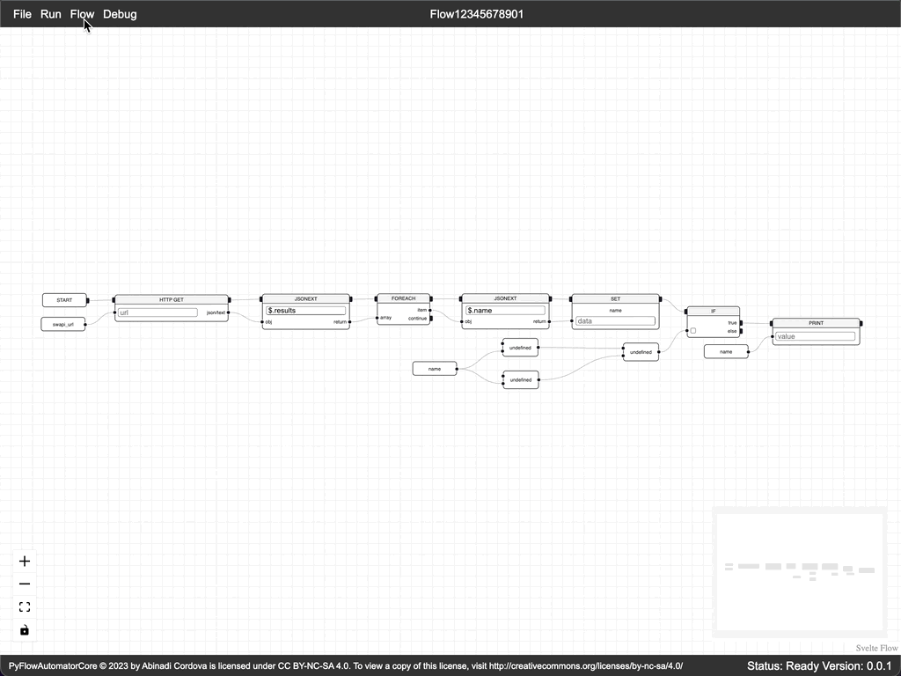

# PyFlowAutomator

PyFlowAutomator is a web-based visual scripting UI for the PyFlowAutomatorCore engine. It's built to handle the needs of both individual users and enterprises, and can be deployed horizontally or vertically to scale with your environment. Its core purpose is to enable users to write scripts remotely through a user-friendly UI, and with the PyFlowAutomatorCore REST backend its easy to automate runbooks, act as a first responder to alerts or incidents, and more. You can use any functions in any Python package or create custom functions to run on the backend and create the corresponding nodes in the frontend, making it highly extendable.

## Usage

To use the PyFlowAutomator, just run the UI with `npm run dev` or build it for production with `npm run build` and run it that way.

PyFlowAutomator uses [@xyflow/svelte](https://svelteflow.dev/) (from the creators of reactflow) so the same rules apply with a few modifications.

Creating a flow


Debugging a flow


#### running a flow

With the backend running, the easiest way to run a flow is to open the Live Run window under the Flow menu. Press the start button and the results of each step will show up in the terminal-like view.



Another way is to copy the the flow to clipboard and put it into a json file and then use the script method of PyFlowAutomatorCore.

```
PyFlowAutomatorCore
usage: run.py [-h] [--script SCRIPT] [--out OUT] [--stdout] [--http] [--host HOST] [--port PORT]

Run the application.

options:
  -h, --help       show this help message and exit
  --script SCRIPT  Run a Python script instead of the server. Provide the file path.
  --out OUT        Filepath to save results to. Only available with --script.
  --stdout         Prints the function call and results to stdout. Only available with --script.
  --http           Run FastAPI HTTP/WS server.
  --host HOST      The host to bind to for http/ws services (overrides PFA_HOST env variable). Default is localhost.
  --port PORT      The port to bind to for http/ws services (overrides PFA_PORT env variable). Default is 8000.

Examples:
    python run.py --http --host 0.0.0.0 --port 8080
    python run.py --script my_script.py --out my_saved_results.json --stdout
Environment Variables:
    PFA_LOCAL: set to True when running locally so CORS can be enabled 
    PFA_TRACE: set to True to enable stdout of all step results for troubleshooting
    PFA_DB_CLASS: for any ORM/DB extensibility, a class with CRUD operations for flows 
                that takes no arguments (see app.utils.database for examples) 
                defaults to SimpleInMemoryDB
    PFA_HOST: host to use when starting http/ws server
    PFA_PORT: port to use when starting http/ws server
```

## Examples

From the UI go to the File menu and select to load the sample flow (won't look pretty at the moment because I made changes to the UI, but it will run) and then run using the live run window.

## Collaboration

There is still a lot to do to get to version 1 and I will be updating this as often as I can, but I still do have a day job so if you would like to contribute, please feel free to do any of the following:
* Use it and give feedback through issues
* Request all you want (doesn't mean I will put it in the core version, but I can always make custom versions at this point)
* Fork, create a PR
* Patreon soon...

## License

PyFlowAutomatorCore © 2023 by Abinadi Cordova is licensed under CC BY-NC-SA 4.0. To view a copy of this license, visit http://creativecommons.org/licenses/by-nc-sa/4.0/
