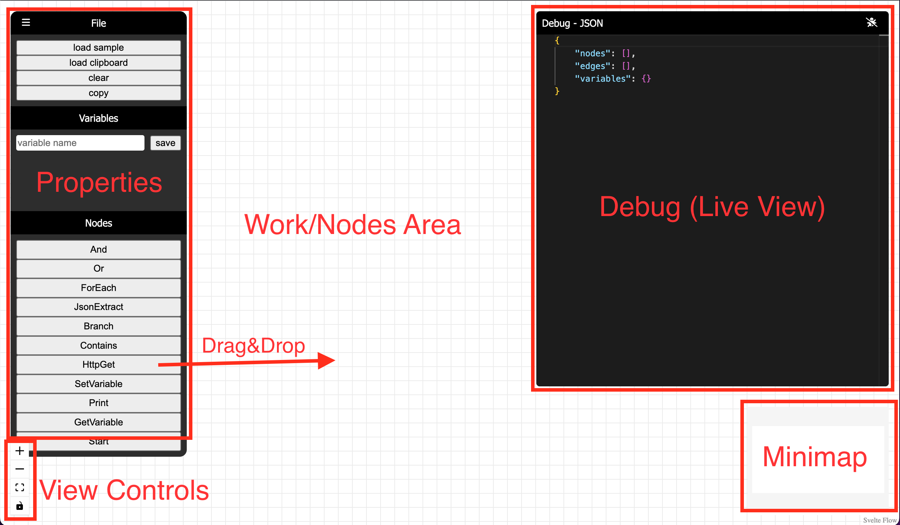

# PyFlowAutomatorCore

PyFlowAutomator is a web-based visual scripting UI for the PyFlowAutomatorCore engine. It's built to handle the needs of both individual users and enterprises, and can be deployed horizontally or vertically to scale with your environment. Its core purpose is to enable users to write scripts remotely through a user-friendly UI, and with the PyFlowAutomatorCore REST backend its easy to automate runbooks, act as a first responder to alerts or incidents, and more. You can use any functions in any Python package or create custom functions to run on the backend and create the corresponding nodes in the frontend, making it highly extendable.

## Usage

To use the PyFlowAutomator, just run the UI with `npm run dev` or build it for production with `npm run build` and run it that way.

PyFlowAutomator uses [@xyflow](https://reactflow.dev/) (formerly reactflow) so the same rules apply with a few modifications.



#### running a flow

At the moment, you can use the copy button in the UI to copy the flow data and save it as a json file to run with the PyFlowAutomatorCore engine. Of course there is a roadmap to change all of this to allow you to send it directly to the backend as http/websocket or save and run later as a script.

```
PyFlowAutomatorCore
usage: run.py [-h] [--http] [--ws] [--script SCRIPT] [--host HOST] [--port PORT] [--debug] [--out OUT]

Run the application.

options:
  -h, --help       show this help message and exit
  --http           Run the HTTP server.
  --ws             Run the WebSocket server.
  --script SCRIPT  Run a Python script instead of the server. Provide the file path.
  --host HOST      The host to bind to for http and ws servers. Default is localhost.
  --port PORT      The port to bind to for http and ws servers. Default is 8000.
  --debug          Enable debug mode. Only available with --http and --script.
  --out OUT        Filepath to save results to or 'stdout' for displaying in console. Default is no save or display. Only available with --script.

Examples: 
python run.py --http --host 0.0.0.0 --port 8080 
python run.py --ws --host example.com --port 9000 
python run.py --script my_script.py --debug
```

## Examples

From the root of the project run `python run.py --script "tests/example_logic.json" --out stdout` or `python run.py --script "tests/example_logic.json" --out my_results.json` to save the results to file instead.

## License

PyFlowAutomatorCore © 2023 by Abinadi Cordova is licensed under CC BY-NC-SA 4.0. To view a copy of this license, visit http://creativecommons.org/licenses/by-nc-sa/4.0/